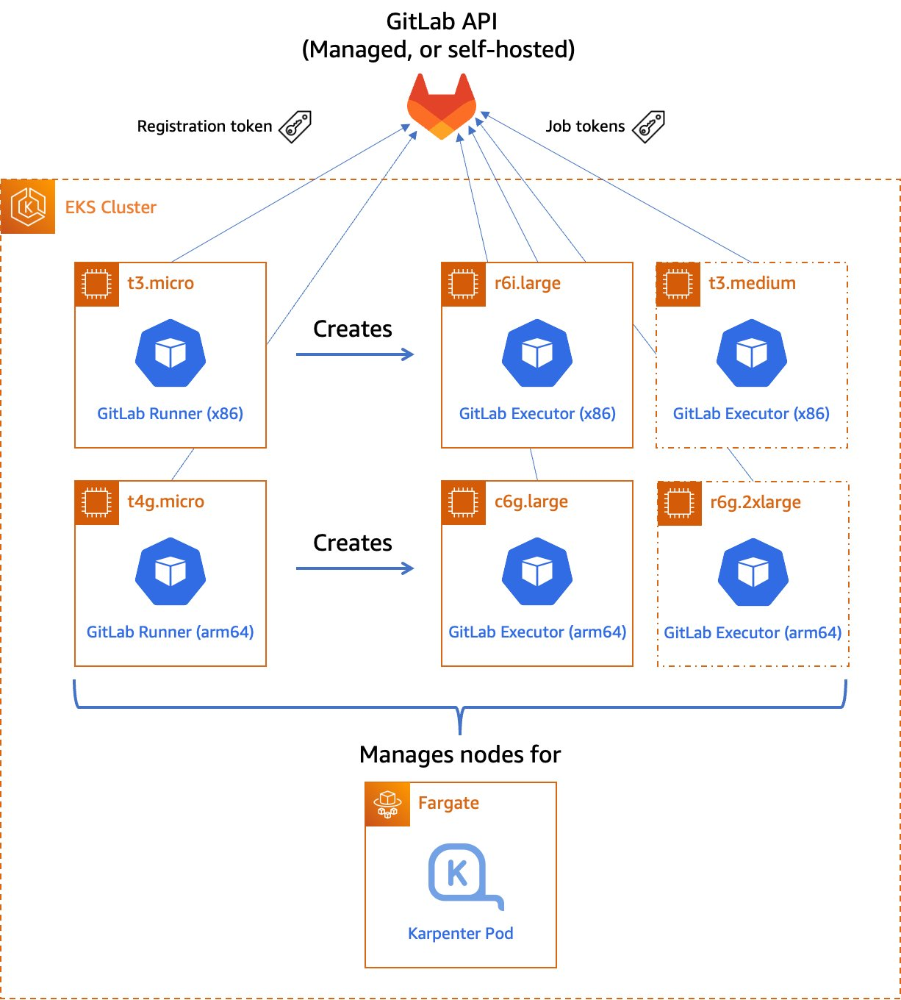

# GitLab Runners on EKS Fargate pattern
GitLab Runner is an application that works with GitLab CI/CD to run jobs in a pipeline. Many AWS customers are using GitLab for their DevOps needs, including source control, and continuous integration and continuous delivery (CI/CD). Many of our customers are using GitLab SaaS (the hosted edition), while others are using GitLab Self-managed to meet their security and compliance requirements.

Customers can easily add runners to their GitLab instance to perform various CI/CD jobs. These jobs include compiling source code, building software packages or container images, performing unit and integration testing, etc.—even all the way to production deployment. For the SaaS edition, GitLab offers hosted runners, and customers can provide their own runners as well. Customers who run GitLab Self-managed must provide their own runners.

In this pattern, we’ll discuss how customers can maximize their CI/CD capabilities by managing their GitLab runner and executor fleet with Amazon Elastic Kubernetes Service (Amazon EKS) on Fargate.



## Prerequisites:

Ensure that you have installed the following tools on your machine.

1. [aws cli](https://docs.aws.amazon.com/cli/latest/userguide/install-cliv2.html)
2. [kubectl](https://Kubernetes.io/docs/tasks/tools/)
3. [cdk](https://docs.aws.amazon.com/cdk/v2/guide/getting_started.html#getting_started_install)
4. [npm](https://docs.npmjs.com/cli/v8/commands/npm-install)
5. Instana backend application - Use SaaS (eg [aws](https://aws.amazon.com/marketplace/pp/prodview-hnqy5e3t3fzda?sr=0-1&ref_=beagle&applicationId=AWSMPContessa)) or Install self-hosted Instana backend ([on-premises](https://www.ibm.com/docs/en/instana-observability/current?topic=installing-configuring-self-hosted-instana-backend-premises))

## Project Setup
Clone the repository

```sh
git clone https://github.com/aws-samples/cdk-eks-blueprints-patterns.git
```

Go inside project directory (eg. cdk-eks-blueprints-patterns)

```sh
cd cdk-eks-blueprints-patterns
```

Install project dependencies.

```sh
make deps
```

## Storing Gitlab Token Secrets 

Please check [GitLab Runner](https://docs.gitlab.com/runner/register/) to learn more about creating GitLab Runner token from your GitLab repo for running CICD process.

AWS Systems Manager (SSM) Parameter Store willbe used to store the Gitlab Token: Update the GitLab token secret in AWS SSM Parameter Store using the below command. This will be referenced by GitLab Runner deployment of our solution to GitLab from Amazon EKS Cluster.

```bash
aws ssm put-parameter --name “/gitlab-runner/runner-registration-token” \
    --type “SecureString” \
    --value $TOKEN \
    --region $AWS_REGION
aws ssm put-parameter --name “/gitlab-runner/runner-token” \
    --type “SecureString” \
    --value “” \
    --region $AWS_REGION
```


## Deploy EKS Cluster with Amazon EKS Blueprints for CDK

To view patterns and deploy ```gitlab-runner``` pattern

```sh
make deps
make build
cdk bootstrap
make pattern gitlab-runner deploy
```


## Verify the resources

Run update-kubeconfig command. You should be able to get the command from CDK output message. More information can be found at https://aws-quickstart.github.io/cdk-eks-blueprints/getting-started/#cluster-access
```sh
aws eks update-kubeconfig --name <your cluster name> --region <your region> --role-arn arn:aws:iam::xxxxxxxxx:role/eks-blue1-eksblue1AccessRole32C5DF05-1NBFCH8INI08A
```

Lets verify the resources created by Steps above.
```sh
kubectl get pods -n instana-agent # Output shows the EKS Managed Node group nodes under instana-agent namespace
```
Output of the above command will be silimar to below one:

```output
❯ kubectl get pods -n gitlab
NAME                            READY   STATUS              RESTARTS   AGE
gitlab-runner-567fd7dd5-k82ch   0/1     ContainerCreating   0          10m
```

## Cleanup

To clean up your EKS Blueprints, run the following commands:

```sh
make pattern gitlab-runner destroy 

```